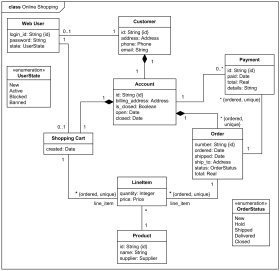

# Simulation Design Plan
### 7
### Jack Ellwood - jce22, Hayden Lau - hpl5, Jason Qiu - jq39


## Design Overview

Our main classes will include a `Simulation`, `Cell`, `Grid`, `Neighborhood`, classes. `Simulation`
will be used to visualize the actual simulation.  `Cell` serve as an object for each cell in the
simulation. `Grid` will configure the locations of cells by storing their locations in a 2D array and
updating itself on each frame. `Neighborhood` will be used to assess the neighbors of a cell and update
the cell based on its neighbors.

```java
import javafx.application.Application;

public class Simulation extends Application{
  public Grid myGrid;

  public void start(Stage stage);
  Scene setupScene();
  void step(double elapsedTime);
}
```

```java
public class Cell {
  private String myValue; // Could store some basic info about the cell
  private Neighborhood myNeighbors;
  
  public Cell(int value, Grid grid); // Might need a grid to initialize its neighbors
  public void updateCell(); // Use information about my neighbors to update myself

}
```

```java
public class Grid {
  private List<List<Cell>> myCells;

  public Grid(String cellFile); // This constructor should take in a path to the csv file, doesn't necessarily have to be a String
}
```

```java
public class Neighborhood {
  private List<List<Cell>> myCells;

  public Neighborhood(Cell cell, Grid grid); // Builds a neighborhood for a given cell
  public updateCells(Grid grid); // Performs calculations for a given neighborhood and updates a grid

}
```

## Design Details

Here is a graphical look at my design:



made from [a tool that generates UML from existing code](http://staruml.io/).


## Design Considerations

* How the neighborhoods interact with other neighborhoods and how the neighborhoods' cells interact with each other.

 Probably one of the major challenges we'll face as the project progresses will be dealing with different
 sets of rules for different games and different types of neighborhoods.  While the basic implementation
 of the GUI and Cell objects will remain the same, the actual interactions could be very different
 from simulation to simulation.

## User Interface

Here is our amazing UI:


taken from [Brilliant Examples of Sketched UI Wireframes and Mock-Ups](https://onextrapixel.com/40-brilliant-examples-of-sketched-ui-wireframes-and-mock-ups/).


## Team Responsibilities

 * Team Member #1 - Hayden Lau
    * CSV file handling (Configuration)
    * Implementation of 2D grid of rectangular cells
    
 * Team Member #2 - Jack Ellwood
    * Display of the current state of the 2D grid of cells
    * Overall Visualization
     
 * Team Member #3 - Jason Qiu
    * Implement Rules for the Game of Life