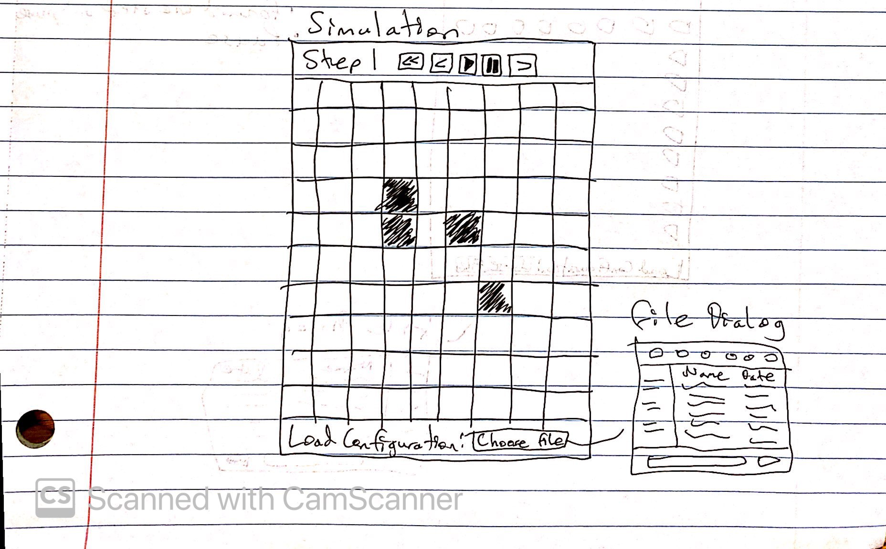

# Simulation Design Plan
### Team Number
### Names

## Design Overview

## Design Details

Here is a graphical look at my design:

made from [a tool that generates UML from existing code](http://staruml.io/).

## Design Considerations

* How the neighborhoods interact with other neighborhoods and how the neighborhoods' cells interact with each other.

## User Interface

Here is our amazing UI:

Users can load in a file by clicking on Choose File button and picking their CSV file from the File
Dialog that pops up. The user can also click the top animation buttons to step through. In order from
left to right, the button's functionalities are as follows: reset to step 1, go back 1 step and pause, play
animation, pause, and go forward 1 step and pause.

## Team Responsibilities

 * Team Member #1 - Hayden Lau
    * CSV file handling (Configuration)
    * Implementation of 2D grid of rectangular cells
    
 * Team Member #2 - Jack Ellwood
    * Display of the current state of the 2D grid of cells
    * Overall Visualization
     
 * Team Member #3 - Jason Qiu
    * Implement Rules for the Game of Life